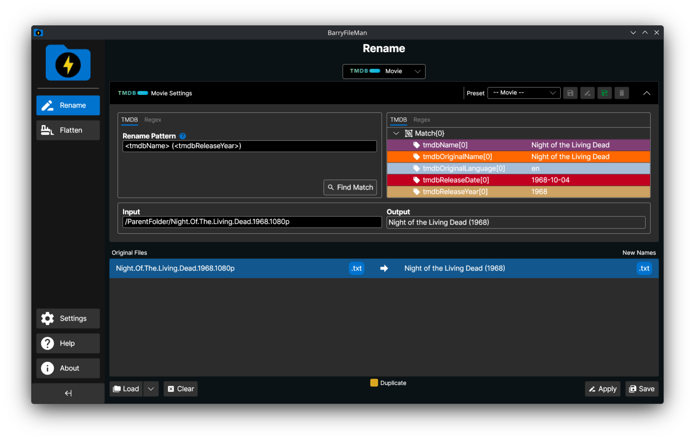
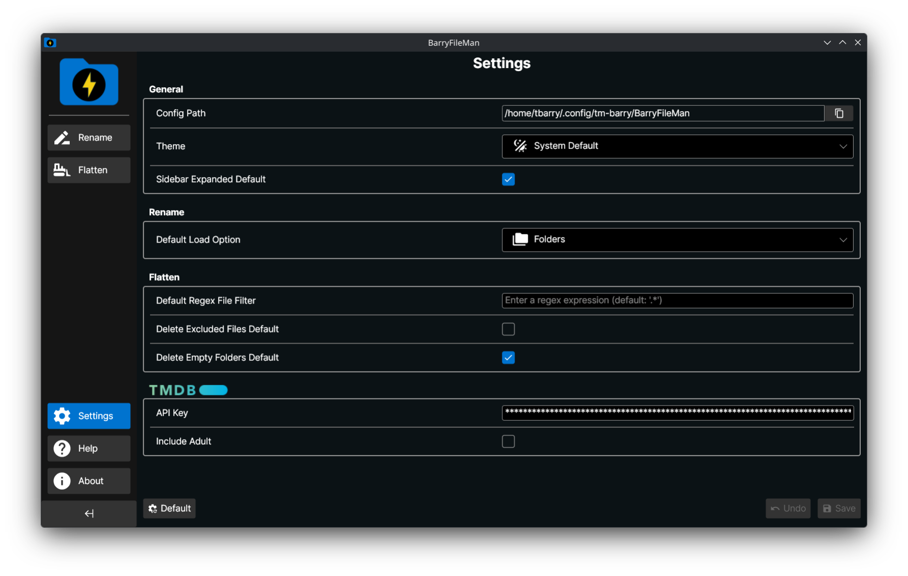

	

<h1 align="center">BarryFileMan</h1>

BarryFileMan is a file manager with a primary focus of renaming and managing media files and folders.

	

	

## Build
pupnet --runtime linux-x64 --kind appimage

## Acknowledgements

This application uses TMDB and the TMDB APIs but is not endorsed, certified, or otherwise approved by TMDB.

## License

BarryFileMan is licensed under the MIT license.

[Jump to license](license.md)
